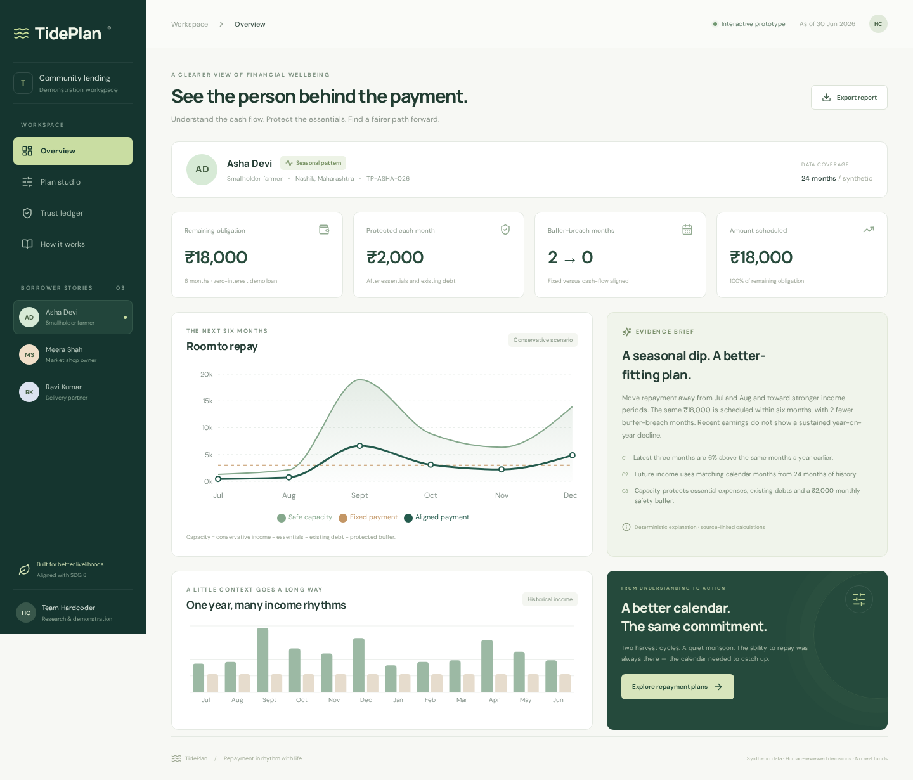
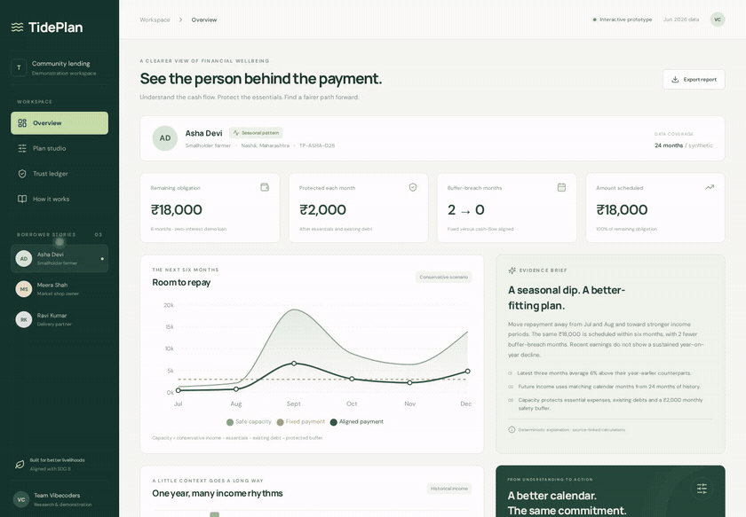
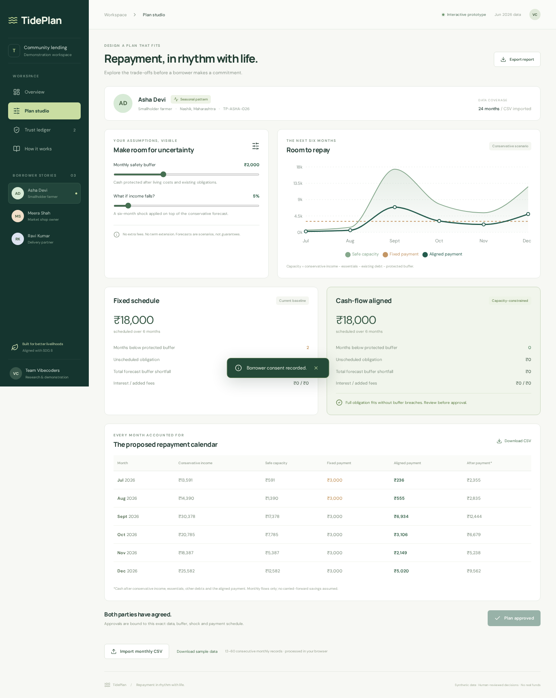
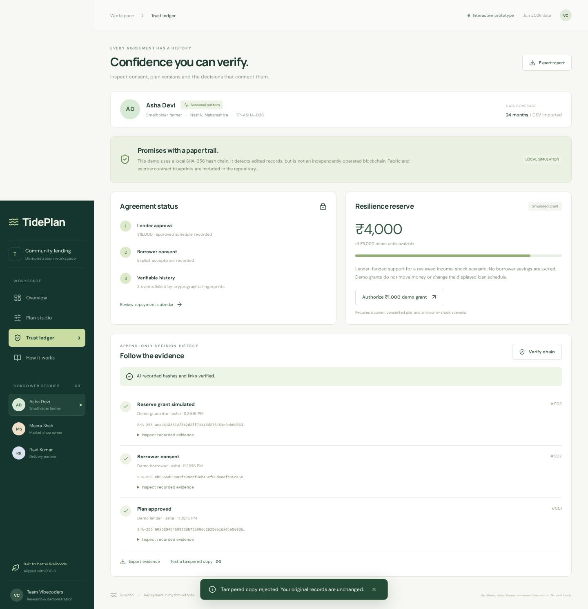
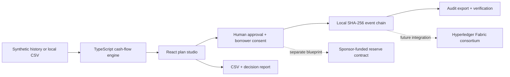

<div align="center">

# TidePlan

### Repayment, in rhythm with life.

**A missed date is not always a missing ability to repay.**

Cash-flow-aware microloan planning · Explicit borrower consent · Verifiable decision history

[**Launch the interactive demo →**](https://preethesh16.github.io/Tideplan/) · [**Watch the narrated walkthrough →**](https://preethesh16.github.io/Tideplan/demo/) · [Technology](#architecture--technology) · [Validation](docs/VALIDATION.md)

Built by **Team Vibecoders** · Problem: **Dynamic Microloan Repayment & Cash-Flow Planning** · **SDG 8**

[](https://github.com/Preethesh16/Tideplan/actions/workflows/pages.yml)

</div>



> **Working prototype, honest boundaries.** The demo runs entirely in your browser with synthetic data. It makes real calculations and stores local demo approvals. It does not move money, call an AI model, connect to a bank, or deploy a blockchain. No account, API key, or wallet is required.

## The problem: the calendar can be the risk

A farmer earns after a harvest. A shopkeeper earns more during festivals. A delivery worker can experience a genuine, sustained loss of income. Giving all three the same fixed monthly repayment structure hides the difference between **a timing mismatch** and **a deterioration in ability to repay**.

A credit score alone does not answer the practical question:

**“What can this person pay, in which months, without consuming the money they need to live and work?”**

TidePlan puts that question at the centre of a lender–borrower conversation. It preserves the obligation where capacity allows, changes the timing, makes assumptions visible, and refuses to disguise an unscheduled balance as success.

## Try the story in two minutes

1. **Start with Asha Devi.** Her harvest-linked income can cover ₹18,000 across six months, but equal ₹3,000 payments breach her chosen buffer twice.
2. **Open Plan studio.** Compare the fixed schedule with payments aligned to conservative monthly capacity. Adjust the buffer and income-shock sliders.
3. **Try a 60% shock.** The app shows an unscheduled obligation and disables approval. Flexibility cannot manufacture income.
4. **Return to a 5% shock.** Approve as the demo lender, review the exact monthly amounts, then explicitly accept as the demo borrower.
5. **Open Trust ledger.** Simulate a ₹1,000 reserve grant, verify the event hashes, and test a tampered copy. Nothing moves on a payment network.
6. **Switch to Ravi Kumar.** A sustained year-on-year decline is flagged for intervention—not explained away as seasonality.

## Watch the complete product walkthrough

[](https://preethesh16.github.io/Tideplan/demo/)

**[Play with narration, English captions and chapter navigation →](https://preethesh16.github.io/Tideplan/demo/)**

The recording starts at the overview and covers all three borrower profiles, explanations, buffer and shock controls, safe failure, monthly payments, CSV validation/import, lender approval, borrower acceptance, version changes, reserve support, tamper detection and evidence exports. It closes with the architecture and prototype boundaries.

[Download MP4](https://preethesh16.github.io/Tideplan/demo/tideplan-demo.mp4) · [Read the transcript](https://preethesh16.github.io/Tideplan/demo/transcript.txt) · [Reproduce the recording](docs/DEMO.md)

Actual screen recording, not a slideshow. Voiceover is AI-generated. The dedicated player avoids GitHub's unsupported MP4 source-file preview.

## One example, every rupee accounted for

**Synthetic Asha scenario:** ₹18,000 obligation; ₹2,000 protected monthly buffer; ₹11,000 essentials and existing obligations; 15% conservative income haircut; no additional shock; zero interest.

| Metric                               | Fixed schedule | TidePlan aligned schedule |
| ------------------------------------ | -------------: | ------------------------: |
| Total scheduled                      |        ₹18,000 |                   ₹18,000 |
| Planning horizon                     |       6 months |                  6 months |
| Months below the protected buffer    |              2 |                         0 |
| Total forecast buffer shortfall      |         ₹2,547 |                        ₹0 |
| Lowest monthly cash after repayments |           ₹306 |                    ₹2,850 |
| Additional interest or fees          |             ₹0 |                        ₹0 |

Aligned payments for July–December: **₹456 · ₹750 · ₹6,621 · ₹3,097 · ₹2,217 · ₹4,859**.

These are reproducible scenario outputs, **not measured improvements in real loan recovery**. Actual results depend on income, expenses, loan terms and forecast accuracy.

## What makes TidePlan different

| Design choice                           | Why it matters                                                                                                             |
| --------------------------------------- | -------------------------------------------------------------------------------------------------------------------------- |
| Timing before labelling                 | Compares recent income with the same months a year earlier before flagging sustained decline.                              |
| A visible affordability floor           | Essentials, existing debts and the chosen buffer are deducted before allocating repayments.                                |
| Alternatives, not one unexplained score | Shows exact payments, stress months, shortfalls and unscheduled debt side by side.                                         |
| Failure is a valid result               | Insufficient capacity leads to a review—not a fabricated “affordable” schedule.                                            |
| Consent tied to a specific version      | Changing the inputs invalidates the current approval match. A borrower accepts explicit amounts.                           |
| Trust as evidence, not theatre          | Local hash verification works today; consortium ledger and reserve contracts are clearly separated integration blueprints. |

## Features that work today

- **Three synthetic borrower stories:** seasonal farmer, shop owner, and a delivery worker with declining earnings.
- **24-month history and six-month forecast**, with source-derived explanations and visible assumptions.
- **Interactive stress testing:** change the monthly buffer or apply a 0–60% income shock.
- **Capacity-constrained scheduling:** integer rupee amounts, preserved totals, and explicit unscheduled obligations.
- **CSV import:** 12–60 consecutive monthly records, validated and processed locally.
- **Plan approval and borrower acceptance:** a deliberate two-step demonstration workflow.
- **Local audit trail:** SHA-256 linked events, persistent browser storage, verification and a safe tampering test.
- **Simulated resilience reserve:** sponsor-funded support with approval, consent and scenario gates.
- **Downloadable evidence:** monthly CSV, full decision report and audit JSON.
- **Responsive interface:** desktop and mobile layouts.

<details>
<summary><strong>See the plan studio and trust ledger</strong></summary>




</details>

## The decision engine

The MVP deliberately uses **inspectable TypeScript calculations**, not an opaque generative answer.

1. Validate consecutive monthly income, essential expenses and existing debt obligations.
2. Compare each of the latest three months with its year-earlier counterpart. If all three are over 15% lower, flag a sustained decline. With insufficient history, disclose the missing evidence.
3. Estimate future income using historical observations of the matching calendar month. Carry a detected decline forward and apply the user's shock assumption.
4. Apply a **15% conservative scenario haircut**. This is an explicit assumption, not a calibrated confidence interval.
5. Calculate monthly capacity:

```text
capacity = max(0, conservative income − essentials − existing debt − safety buffer)
```

6. Allocate the obligation proportionally across positive capacities, with exact integer rounding. Never allocate above monthly capacity. If aggregate capacity is insufficient, display the unscheduled amount.
7. Compare both schedules, then require a human decision and explicit borrower acceptance.

**Approval gate:** the aligned schedule must cover the full obligation **and** leave every forecast month at or above the chosen buffer. A month with insufficient living-cost coverage is not made safe merely by setting its repayment to zero.

The current model does not carry savings between months, optimise interest-bearing amortisation, model joint household liabilities, or infer causal hardship. A zero repayment cannot eliminate a living-cost deficit; this remains visible as a buffer shortfall. The variation heuristic is not a validated seasonality classifier. Production work requires backtesting, uncertainty calibration and domain review.

## Architecture & technology



| Layer             | Technology                               | Purpose / code                                                                                                |
| ----------------- | ---------------------------------------- | ------------------------------------------------------------------------------------------------------------- |
| Interface         | React 18 + TypeScript                    | Borrower views, controls and consent — [`src/App.tsx`](src/App.tsx)                                           |
| Visualisation     | Recharts                                 | Historical cash flow and schedule comparison — [`src/App.tsx`](src/App.tsx)                                   |
| Decision engine   | TypeScript                               | Forecasts, constraints and transparent explanations — [`src/engine.ts`](src/engine.ts)                        |
| Data              | Synthetic fixtures + Papa Parse          | Local CSV validation and ingestion — [`src/data.ts`](src/data.ts)                                             |
| Audit             | Web Crypto SHA-256 + localStorage        | Local event hashing and verification — [`src/trust.ts`](src/trust.ts)                                         |
| Styling           | CSS + Lucide icons                       | Responsive, accessible controls — [`src/styles.css`](src/styles.css)                                          |
| Build / hosting   | Vite + GitHub Actions + Pages            | Static build, tests and publication — [workflow](.github/workflows/pages.yml)                                 |
| Tests             | Node test runner + tsx + Playwright      | Calculation invariants and browser journey — [`tests/`](tests/)                                               |
| Trust blueprint   | Hyperledger Fabric chaincode, JavaScript | Organisation approval and identity-bound consent — [`contracts/fabric/`](contracts/fabric/)                   |
| Reserve blueprint | Solidity                                 | Consent-gated, capped sponsor releases — [`contracts/ResilienceReserve.sol`](contracts/ResilienceReserve.sol) |

**AI note:** LangChain, LangGraph and an LLM are not required or used in this MVP. A future language assistant could explain the engine's verified outputs in local languages; it should not invent amounts or override approval rules.

## Why blockchain—and where it stops

The value is **shared evidence between organisations**, not using a token to decide whether a borrower deserves flexibility.

- **Fabric, proposed:** independently operated lender/partner peers can share plan versions and consent evidence under membership and endorsement rules.
- **Reserve contract, proposed:** make sponsor-funded support conditional on a consented plan and a bounded, human-authorised release.
- **Current implementation:** a local hash chain catches edited events during verification. A browser owner can replace the entire chain, so it does **not** provide independent immutability. Demo roles are not authentication.
- **Always off-chain:** raw income records, personal documents and sensitive household details.

See [trust boundaries and contract limitations](contracts/README.md). Neither blueprint is audited, deployed or connected to the demo. No real funds should be used.

## Run locally

Requires Node.js 20+ and npm.

```bash
git clone https://github.com/Preethesh16/Tideplan.git
cd Tideplan
npm ci
npm run dev
```

Open `http://localhost:4180`. No environment file or secret is needed.

```bash
npm test                  # model, validation and audit tests
npm run build             # type check + production bundle
npx playwright install chromium
npm run test:browser       # with the dev server running
npm run test:browser:ci    # starts and stops its own test server
```

The **12 model/audit tests** include **507 buffer/shock/profile combinations**, exact allocations, insufficient capacity, living-cost deficits, seasonal versus decline examples, malformed history and hash tampering. Browser checks cover CSV imports, exported JSON, consent, scenario changes, reserve gates and limits, persistence and mobile layout. These checks also run before GitHub Pages publication. See the [validation record](docs/VALIDATION.md).

### Bring a synthetic CSV

```csv
month,income,essentials,obligations
2024-07,16830,10000,1000
2024-08,17820,10000,1000
```

Supply **12–60 consecutive months**, oldest first. Download a complete sample in Plan studio. Imports change the selected profile's cash-flow history, not its loan principal. Imported rows are session-local; approved snapshots and audit events persist in that browser. Do not upload real sensitive financial data to a public demonstration.

### Repository guide

```text
src/
  App.tsx                 Product workflow and visualisations
  engine.ts               Financial scenario calculations
  data.ts                 Three synthetic borrower histories
  trust.ts                Canonical hashing and verification
  styles.css              Responsive design system
tests/                    Engine and audit tests
scripts/                  Browser checks and demo recording
contracts/                Separate trust/reserve blueprints
docs/images/              Screenshots from the working app
public/demo/              Narrated recording and video player
.github/workflows/        Test → build → GitHub Pages
```

## SDG 8 alignment

TidePlan supports the intent of **SDG 8: Decent Work and Economic Growth**, especially **target 8.10**, access to financial services. Protecting essential expenditure and working capital while making repayment commitments transparent can support productive livelihoods. That is an intended impact, not a proven outcome of this prototype.

To evaluate it responsibly: measure buffer-breach months, forecast error, outstanding debt, total borrower cost, informed-consent completion and lender recovery in a consented pilot. Check performance across livelihood types and do not penalise a borrower solely for a model signal.

## Next, with evidence

### Business path: sell better planning, not borrower penalties

The proposed customer is a microfinance institution, cooperative or lending NGO. Start with a small, consented retrospective pilot; compare affordability, staff review effort and recovery outcomes. If the results justify adoption, offer an institutional subscription with optional onboarding support. Borrowers are not charged TidePlan penalty fees. Pricing, partnerships and willingness to pay remain unvalidated.

### Responsible product roadmap

1. Backtest against realistic seasonal and shock scenarios; add forecast intervals and variable interest terms.
2. Add authenticated lender/borrower roles, revocable consent and protected backend storage.
3. Pilot with domain experts and borrowers; validate affordability and recovery outcomes together.
4. Connect a permissioned Fabric network only where independent organisations need shared attestations.
5. Integrate a regulated payment/reserve provider after appropriate review—not automatic deductions from forecast data.

---

**TidePlan does not make debt disappear. It makes the repayment decision easier to understand, discuss and verify.**
